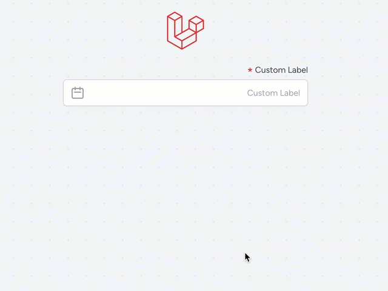

<p align="center"></p>

## Livewire Persian Datepicker

This package is a Persian datepicker tool for Laravel.

This tool is made as a component for Livewire, which requires the following requirements:


## Requirements

- laravel +9.0
- livewire +2.5
- alpinejs +3.0.6
- tailwindcss +3.0.0
- jalali-moment +3.3.11

## Installation

To install the package, run the following code in the path of your project
```
composer require alirahimi/livewire-persian-datepicker 
```
If you have already installed npm, the command above will automatically add the required items to package.json and reinstall npm. Otherwise, you have to manually install the necessary packages mentioned above.

After installing this package, a file called ```persian-datepicker.blade.php``` will be added to the ```resources/views/components``` folder and a file named ```livewire-datepicker-datepicker.js``` will be added to the ```resources/js``` folder of your project. 
If for any reason these two files are not created automatically, you can type the following command into the console:
```
php artisan vendor:publish --provider="AliRahimi\LivewirePersianDatepicker\LivewirePersianDatepickerServiceProvider"
```

Then you need to import the ```resources/js/datepicker-datepicker.js``` file in ```resources/js/app.js```.
```
import './livewire-datepicker-datepicker';
```

Now, if you are using webpack, enter the following command:
```
npm install
npm run dev
```

And if you use vite, enter the following command:
```
npm install
vite run dev
```

## How to use

This component is easy to use. It has 5 entries that you can enter as you wish. I will give you an example below:
```
<x-persian-datepicker label="Custom Label" wirePropertyName="component_persian_date_prpperty_name" showFormat="jYYYY/jMM/jDD" returnFormat="X" defaultDate="2023-01-10 21:30:00"/>
```

- label: input label
- wirePropertyName: The livewire property to which the information is sent after selecting the date
- showFormat: Date format for the selected date (Jalali date format-moment)
- returnFormat: Date format that is sent to the server (X = timestamp)
- defaultDate: Date picker default date


## Preview

<p align="center"></p>
