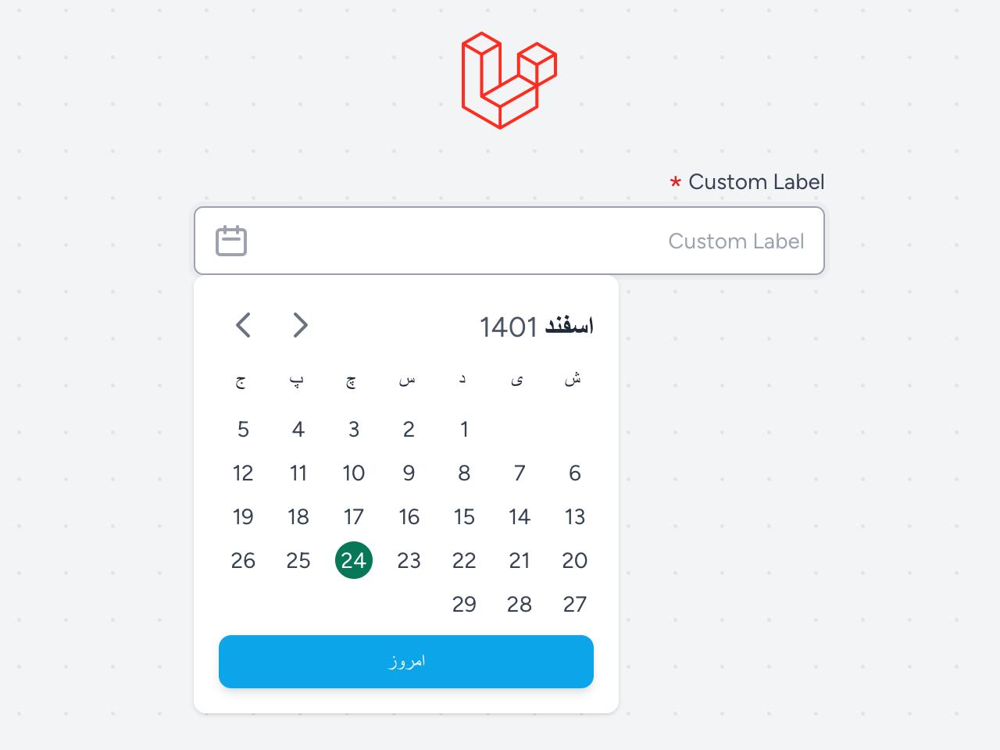

<p align="center"></p>

## Livewire Persian Datepicker

This package is a Persian datepicker tool for Laravel 9/10/11.

This tool is made as a component for Livewire, which requires the following requirements:

## Requirements

- laravel +9.0
- livewire +2.5
- alpinejs +3.0.6
- tailwindcss +3.0.0
- jalali-moment +3.3.11

## Installation

To install the package, run the following code in the path of your project

```
composer require alirahimi/livewire-persian-datepicker 
```

After installing with Composer, you need to publish the project files and install the npm requirements. With the
following command, the mentioned tasks will be done automatically.

```
php artisan livewire:persian-datepicker
```

If you have already installed npm, the command above will automatically add the required items to package.json and
reinstall npm. Otherwise, you have to manually install the necessary packages mentioned above.

After installing this package, a file called ```persian-datepicker.blade.php``` will be added to
the ```resources/views/components``` folder and a file named ```livewire-datepicker-datepicker.js``` will be added to
the ```resources/js``` folder of your project.
If for any reason these two files are not created automatically, you can type the following command into the console:

```
php artisan vendor:publish --provider="AliRahimi\LivewirePersianDatepicker\LivewirePersianDatepickerServiceProvider" --tag="livewire-persian-datepicker" --force
```

Then you need to import the ```resources/js/datepicker-datepicker.js``` file in ```resources/js/app.js```.

```
import './livewire-datepicker-datepicker';
```

Finally, the ```resources/js/app.js``` file should look like this:

```
import './bootstrap';
import './livewire-datepicker-datepicker';

import Alpine from 'alpinejs';  // Livewire < 3.0
window.Alpine = Alpine;         // Livewire < 3.0
Alpine.start();                 // Livewire < 3.0
```

And the ```resources/css/app.css``` file should look like this:

```
@tailwind base;
@tailwind components;
@tailwind utilities;
```

<br /><br /><br />
Now, if you are using webpack, enter the following command:

```
npm install
npm run dev
```

And if you use vite, enter the following command:

```
npm install
vite run dev
```

Tip: You need to call the created JavaScript and style files in your template:

```
<html>
    <head>
        .
        .
        .
        <link rel="stylesheet" href="{{ mix('css/app.css') }}">
        @livewireStyles
    </head>
    <body>
        .
        .
        .
        <script src="{{ mix('js/app.js') }}" defer></script>
        @livewireScripts
    </body>
</html>
```

## How to use

This component is easy to use. It has 9 entries that you can enter as you wish. I will give you an example below:

```
<x-persian-datepicker 
    wirePropertyName="livewire-component.property"
    label="Custom Label"
    showFormat="jYYYY/jMM/jDD"
    returnFormat="X"
    :required="true"
    :defaultDate="date('Y-m-d H:i:s')"
    :setNullInput="true"
    :withTime="true"
    :ignoreWire="true"
    :withTimeSeconds="true"/>
```

component property description:

|     Property     | Required |    Default    |                                   Description                                   |
|:----------------:|:--------:|:-------------:|:-------------------------------------------------------------------------------:|
| wirePropertyName |   Yes    |     null      | The livewire property to which the information is sent after selecting the date |
|      label       |    No    |     null      |                                   input label                                   |
|   currentView    |    No    |      day      |                   Default Datepicker view (day, month, year).                   |
|    showFormat    |    No    | jYYYY/jMM/jDD |     Date format for the selected date (Jalali date format => jalali-moment)     |
|   returnFormat   |    No    |       X       |             Date format that is sent to the server (X = timestamp)              |
|     required     |    No    |     false     |                            Add red Star after label                             |
|   defaultDate    |    No    |     null      |                  Datepicker default date (null = current date)                  |
|     minDate      |    No    |     null      |                   Datepicker min date (null = without limit)                    |
|     maxDate      |    No    |     null      |                   Datepicker max date (null = without limit)                    |
|   setNullInput   |    No    |     false     |                     Can set the default Datepicker to null                      |
|    ignoreWire    |    No    |     true      |               Ignores livewire changes (recommended for time use)               |
|     withTime     |    No    |     false     |             Can enable Datepicker time inputs (Hour Minute Second)              |
| withTimeSeconds  |    No    |     true      |                      Can disable Datepicker seconds input                       |

## Preview

<p align="center"></p>
